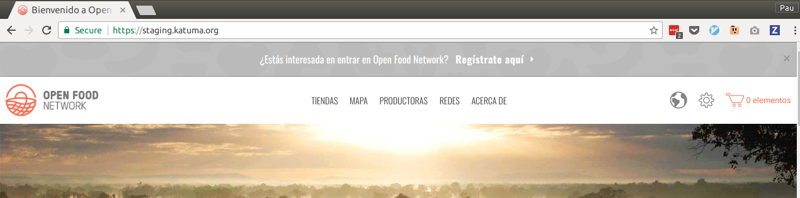
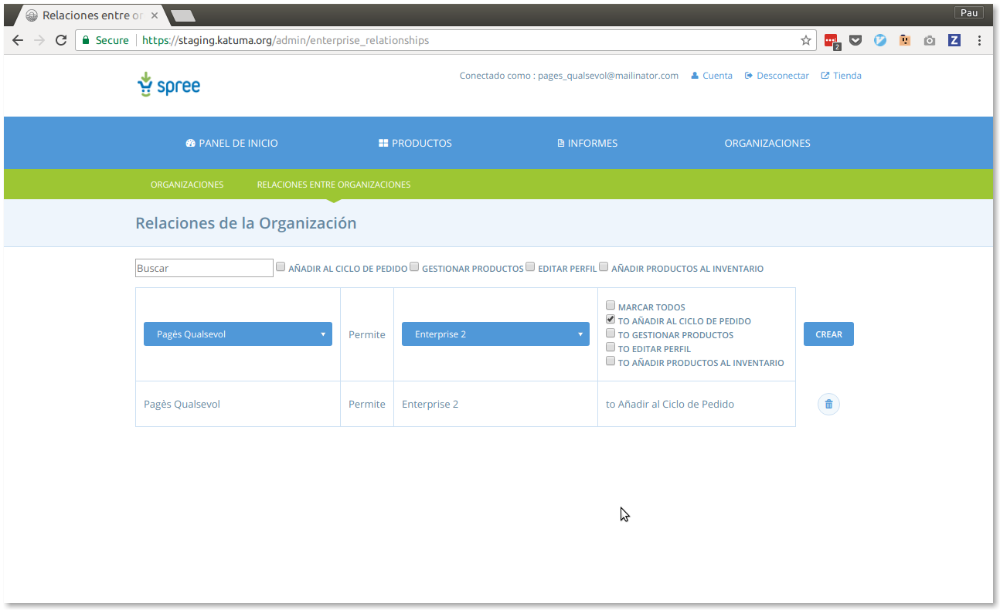
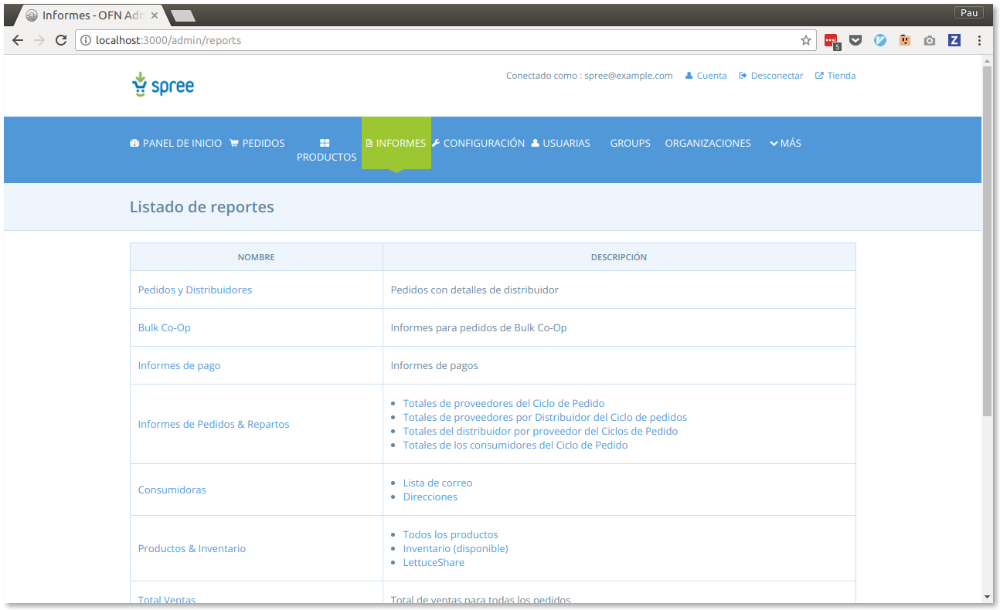
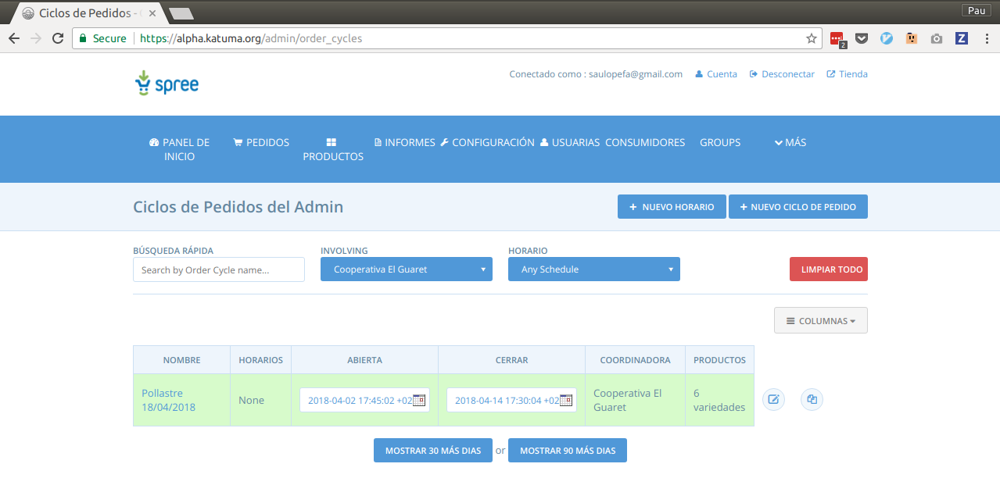

# Katuma

---

## Visió

Superar els reptes que té el sector d'agricultura ecològica i de proximitat per tal de fer un salt d'escala que el permeti sobreviure als temps

---

## Objectius
* Que la gent no abandoni els grups de consum i més s'hi sumi.  
* Permetre als grups centrar-se en ser eina de transformació fent altres activitats més enllà de la gestió diària: Cinefòrum, xerrades, fires, sensibilització, comunicació, etc.

* Potenciar productors petits i de proximitat ampliant volum de negoci sense dedicar-hi més hores

* Reduir els costos de la distribució de productors a grups de consum 
* Construir la intercooperació entre el sector que permeti afrontar els reptes de futur amb més garanties d'èxit.

---

## Mitjans

* Simplificar la gestió de les comandes a grups i productors a través d'una plataforma tecnològica

* Esdevenir una cooperativa de membres del sector d'agricultura ecològica i de proximitat catalana que tingui la propietat sobre aquesta plataforma i permeti afrontar els reptes com a sector.

---

## Objectius pel 2018

* Implicar la comunitat
* Acompanyar als actors: grups, productores i usuàries
* Enllestir MVP (Producte mínim viable)
* Projecte empresarial

---

## Primers passos

---

### Com crear un compte pel productor

---

### Com crear un compte pel productor

1. Clicar a "¿Estás interesada en entrar en Open Food Network? Regístrate aquí"
2. Seguir els passos

---

## Configuració

---

### Afegir productes

---

### Afegir productes

Des de la secció d'administració:

1. Entrar a "Productos"
2. Clicar a "Nuevo producto"
3. Omplir els detalls del producte

Un cop afegit:

1. Clicar a "Editar"
2. Clicar a "Variantes"
3. Omplir els detalls de la variant

---

### Habilitar relacions entre organitzacions

---

### Habilitar relacions entre organitzacions

Des de la secció "Organizaciones" de l'administració:

1. Clicar a "Relaciones entre organizaciones"
2. Seleccionar el productor a la primera columna
3. Seleccionar el grup de consum al que es proveeix a la segona columna
4. Marcar l'opció "Añadir al ciclo de pedido"
5. Clicar a "Crear"

---

## Comandes

---

### Consultar comandes

---

### Consultar comandes

Des de la secció d'informes de l'administració:

1. Clicar a "Totales del distribuidor por proveedor del Ciclos de Pedido"
2. Seleccionar el grup de consum al primer camp
3. Seleccionar el cicle de comanda que correspongui
4. Clicar a "Buscar"

Guia: [http://community.coopdevs.org/t/guia-repartiment-de-comandes/280](http://community.coopdevs.org/t/guia-repartiment-de-comandes/280)

---

### Cicle de comanda

---

### Cicle de comanda

Des de la secció d'administració:

1. Clicar a "Ciclos de pedidos"
2. Clicar a "Editar"
3. Fer les modificacions necessàries com a productor, normalment deseleccionant un producte del llistat de productes "Entrantes"

---

## Preguntes?

[community.coopdevs.org](community.coopdevs.org)
